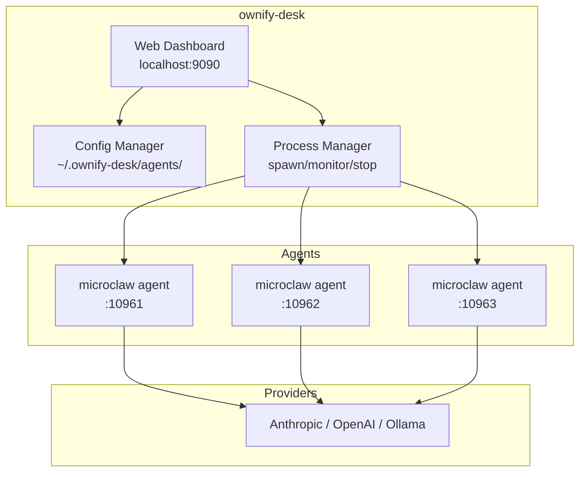

# ownify-desk

Local multi-agent management dashboard for [ownify microclaw](https://github.com/HaraldeRoessler/ownify-microclaw).

## What it does

ownify-desk runs on your machine and manages multiple AI agents (microclaw instances) through a web dashboard:

- **Create agents** with a click — each gets its own config, data directory, and port
- **Start/stop/restart** agents from the dashboard
- **Edit agent configs** — YAML editor with Matrix, Telegram, Discord, Slack presets
- **View logs** per agent in real-time
- **Monitor status** — running, stopped, crashed



## Quick start

```sh
# Install microclaw first
git clone https://github.com/HaraldeRoessler/ownify-microclaw.git
cd ownify-microclaw && cargo build --release

# Install ownify-desk
git clone https://github.com/HaraldeRoessler/ownify-desk.git
cd ownify-desk && cargo build --release

# Start the dashboard
./target/release/ownify-desk start
```

Open `http://localhost:9090` and create your first agent.

## Data layout

```
~/.ownify-desk/
  agents/
    personal-assistant/
      meta.yaml                  # Agent metadata (name, port, auto-start)
      microclaw.config.yaml      # LLM provider + channel config
      data/                       # Sessions, memory, SQLite
      logs/microclaw.log          # Agent runtime logs
    devops-bot/
      meta.yaml
      microclaw.config.yaml
      data/
      logs/
```

## Tech stack

| Layer | Technology |
|---|---|
| Backend | Rust + axum |
| Frontend | React + TypeScript + Vite |
| Agent runtime | [ownify microclaw](https://github.com/HaraldeRoessler/ownify-microclaw) |

## License

MIT
